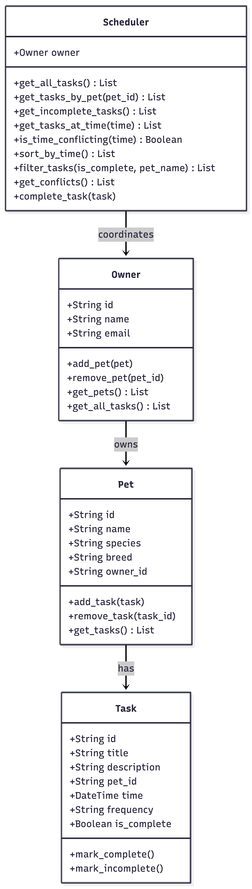

# PawPal+ (Module 2 Project)

You are building **PawPal+**, a Streamlit app that helps a pet owner plan care tasks for their pet.

## Scenario

A busy pet owner needs help staying consistent with pet care. They want an assistant that can:

- Track pet care tasks (walks, feeding, meds, enrichment, grooming, etc.)
- Consider constraints (time available, priority, owner preferences)
- Produce a daily plan and explain why it chose that plan

Your job is to design the system first (UML), then implement the logic in Python, then connect it to the Streamlit UI.

## What you will build

Your final app should:

- Let a user enter basic owner + pet info
- Let a user add/edit tasks (duration + priority at minimum)
- Generate a daily schedule/plan based on constraints and priorities
- Display the plan clearly (and ideally explain the reasoning)
- Include tests for the most important scheduling behaviors

## Features

- **Add owners and pets** — model the real relationship between a person and their animal(s), with each pet maintaining its own task list
- **Task management** — create, remove, and mark tasks complete or incomplete; each task stores a title, description, duration, priority, scheduled time, and recurrence frequency
- **Sort by time** — `Scheduler.sort_by_time()` orders all tasks across all pets chronologically using a lambda key, so the daily schedule always reads earliest-first
- **Filter by status or pet** — `Scheduler.filter_tasks()` accepts an optional completion status and/or pet name, returning only the matching subset; both filters can be combined
- **Conflict detection** — `Scheduler.get_conflicts()` performs a pairwise comparison of all scheduled tasks and surfaces a human-readable warning for any two tasks sharing the same time slot, whether on the same pet or different pets
- **Recurring task auto-scheduling** — `Scheduler.complete_task()` marks a task done and, for `"daily"` or `"weekly"` tasks, automatically creates the next occurrence using Python's `timedelta`
- **Streamlit UI** — interactive web interface with conflict warnings (`st.warning`), a priority-sorted task table, Pending/Completed metrics, and a color-coded schedule view

## 📸 Demo



## Smarter Scheduling

The `Scheduler` class acts as the coordination layer between owners, pets, and tasks. Beyond basic task retrieval, it includes three algorithmic features:

- **Sort by time** — `sort_by_time()` orders all tasks across all pets chronologically using a lambda key on each task's `time` attribute.
- **Conflict detection** — `get_conflicts()` performs a pairwise comparison of scheduled tasks and returns human-readable warning messages for any two tasks sharing the same time slot, whether they belong to the same pet or different pets.
- **Recurring task auto-scheduling** — `complete_task()` marks a task done and, if it has a `frequency` of `"daily"` or `"weekly"`, automatically creates the next occurrence using Python's `timedelta`.

## Testing PawPal+

### Run the tests

```bash
python -m pytest tests/test_pawpal.py -v
```

### What the tests cover

52 tests across all four classes:

- **Task** — default state, marking complete/incomplete, idempotent behavior
- **Pet** — adding and removing tasks, removing a nonexistent task, empty state
- **Owner** — adding/removing pets, removing a pet clears its tasks, `get_all_tasks` across multiple pets
- **Scheduler (basics)** — retrieving tasks by pet, filtering incomplete tasks, time lookups, conflict detection
- **Scheduler (sort/filter)** — chronological sort, filtering by completion status, filtering by pet name, combining both filters
- **Scheduler (conflicts)** — same-pet conflicts, cross-pet conflicts, warning message content, tasks without a time are safely ignored, three-way conflicts
- **Scheduler (complete_task)** — daily/weekly recurrence creates next occurrence with correct time, one-time tasks do not spawn follow-ups, next task inherits all attributes, graceful handling when pet is not found

### Confidence level

★★★★☆ (4/5)

The core scheduling logic is thoroughly tested and all 52 cases pass. One star is held back because task duration is not modeled — the conflict detection only catches exact time matches, not overlapping windows. Any feature that depends on duration or priority at the class level would need additional coverage before the system could be considered fully reliable.

## Getting started

### Setup

```bash
python -m venv .venv
source .venv/bin/activate  # Windows: .venv\Scripts\activate
pip install -r requirements.txt
```

### Suggested workflow

1. Read the scenario carefully and identify requirements and edge cases.
2. Draft a UML diagram (classes, attributes, methods, relationships).
3. Convert UML into Python class stubs (no logic yet).
4. Implement scheduling logic in small increments.
5. Add tests to verify key behaviors.
6. Connect your logic to the Streamlit UI in `app.py`.
7. Refine UML so it matches what you actually built.
